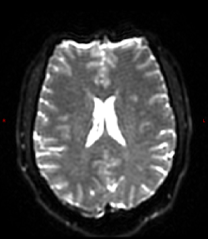

# GEHC MRI Diffusion PSD: Phase-Encoding Polarity & Native Resolution

This guide explains how to manage **phase-encoding polarity** and **native resolution reconstruction** in GE HealthCare diffusion EPI using type-in PSDs such as `epi2alt`, `epi2as`, `epi2asalt`.

## Phase-Encoding Polairty
In GE HealthCare MRI systems, the phase-encoding direction is controlled internally by a research control variable (CV) called `pepolar`, which determines whether the scan uses posterior-to-anterior (PA) or anterior-to-posterior (AP) polarity for phase-encoding direction

By default:
- Non-HyperBand (non-HB) scans use PA polarity (`pepolar` = 0)
- HyperBand (HB) scans use AP polarity (`pepolar` = 1)

To simplify scan setup, a family of type-in PSDs—such as `epi2alt`—was introduced in clinical mode. These PSDs automatically configure the appropriate `pepolar` value internally, eliminating the need for manual CV adjustments and allowing the scan setup to be saved as part of a protocol.

## Native Resolution (No Interpolation)
By default, reconstructed images are interpolated to standard matrix sizes that are powers of 2, such as 256, 512, or 1024. To disable interpolation and reconstruct to the native resolution as prescribed in the scan protocol, users can select type-in PSD `epi2as`


To acquire two scans with opposite PE polarity and native resolution, users can use the type-in PSD `epi2asalt` alongside `epi2as`. See below for detailed examples.


---
## 🧠 Visual Example

| Anterior to Posterior (AP) | Posterior to Anterior (PA) |
|----------------------------|-----------------------------|
|  |  |

---

## 📂 PSD and `pepolar` CV Reference

| `pepolar` Value |  Type | type-in PSD              |
|------------------|-----------|-------------------------------------------------|
| **1** (AP)       | Non-HB    | `epi2alt`, `epi2asalt`                         |
|                  | HyperBand | `epi2`, `epi2as`                               |
| **0** (PA)       | Non-HB    | `epi2`, `epi2as`                               |
|                  | HyperBand | `epi2altoff`, `epi2asaltoff`                  |

---

> ⚠️ `epi2as` variants (e.g., `epi2as`, `epi2asalt`, `epi2asaltoff`) are **NOT compatible with AIR Recon DL**.

---

## ✅ Use Case Examples

**Goal: Acquire two scans with opposite PE polarity**
### Non-HyperBand (Standard DTI)
**Standard Resolution (AIR Recon DL-compatible):**
```text
Scan with PE-polarity = PA; PSD = epi2
Scan with PE-polarity = AP; PSD = epi2alt
```
**Native Resolution (No interpolation):**
```text
Scan with PE-polarity = PA; PSD = epi2as
Scan with PE-polarity = AP; PSD = epi2asalt
```

### HyperBand (Multi-Band DTI)
**Standard Resolution (AIR Recon DL-compatible):**
```text
Scan with PE-polarity = PA; type-in PSD = epi2altoff
Scan with PE-polarity = AP; type-in PSD = epi2
```
**Native Resolution (No interpolation):**
```text
Scan with PE-polarity = PA; PSD = epi2asaltoff
Scan with PE-polarity = AP; PSD = epi2as
```
---

## 🔄 Phase-Encoding Polarity (PE Polarity)
`dcm2niix` automatically converts it into BIDS JSON fields:

| Direction                | Polarity Label | `PhaseEncodingPolarityGE` | `PhaseEncodingDirection` |
|--------------------------|----------------|-----------------------------|---------------------------|
| Anterior to Posterior   | AP             | "Unflipped"                | `-j`                      |
| Posterior to Anterior   | PA             | "Flipped"                  | `j`                       |

---

## 📦 DICOM Tags
GEHC DICOM reports PE polarity since **Rx27**
- `InPlanePhaseEncodingDirection` — **(0018,1312)**
- `Rectilinear Phase Encode Reordering` — **(0018,9034)**


---
_Last updated: May 2025_
